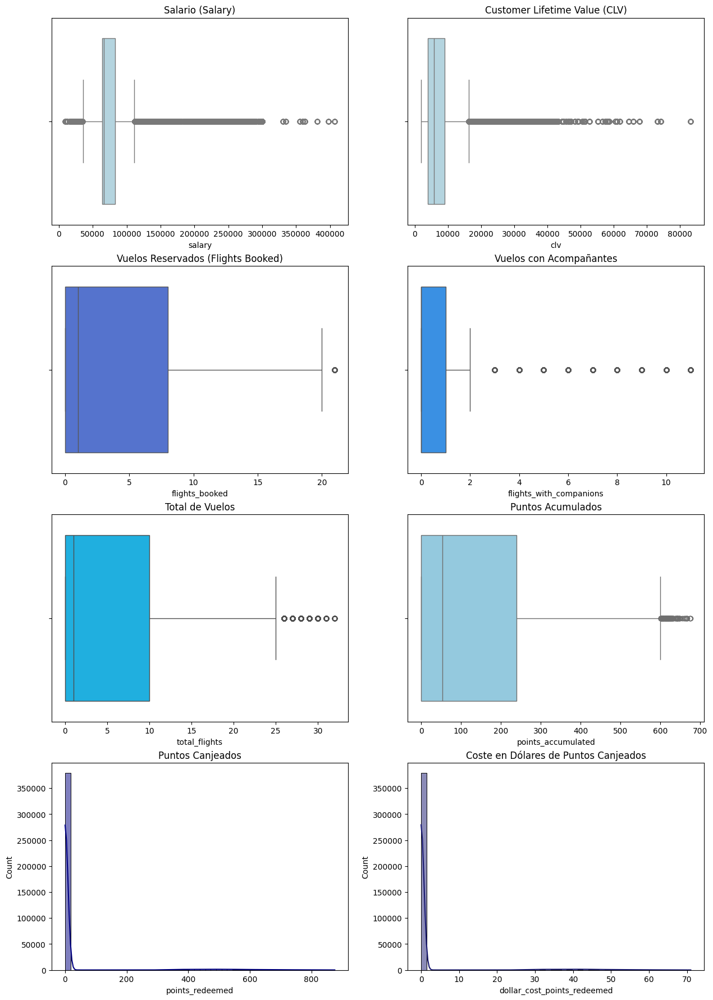

Análisis de Fidelización de Clientes - Aerolínea
En este repositorio tengo los archivos de mi análisis sobre el programa de lealtad de una aerolínea. Básicamente, he limpiado los datos, explorado cómo son los clientes y probado si hay diferencias reales entre ellos.

¿Qué hay en cada archivo?
1. Fase 1: Limpieza de datos (evaluacion_final_mod3_fase1.ipynb)
Aquí es donde empezó todo el "trabajo sucio".

Junté las tablas de clientes y vuelos.

Revisé si había nulos (había bastantes en la columna de salario).

Dejé los datos listos y ordenados para poder trabajar con ellos.

2. Fase 2: Exploración y Visualización (evaluacion_final_mod3_fase2.ipynb)
Esta es la parte visual donde saqué las conclusiones que ya te conté:

Salarios: La mayoría gana entre 50k y 100k.

Provincias: Ontario es nuestro mercado principal.

Perfil: Clientes mayoritariamente casados y con estudios universitarios.

Gráficos: Usé boxplots para ver los valores raros (outliers) y un heatmap para ver qué columnas tienen relación entre sí.

3. Fase 3: Pruebas Estadísticas (evaluacion_final_mod3_fase3.ipynb)
Aquí me puse un poco más serio para confirmar sospechas con números:

Hice un test de hipótesis para ver si el nivel educativo influye en el número de vuelos reservados.

Básicamente, quería saber si las diferencias que vemos en los gráficos son "reales" o solo casualidad.

4. Resumen de exploración (exploracion.md)
Un pequeño documento donde anoté mis interpretaciones rápidas y lo que iba descubriendo de las variables (como que el género está súper equilibrado 50/50).

Herramientas usadas
Python (Pandas, Numpy)

Seaborn y Matplotlib (para que los gráficos se vean bonitos con tonos azules y paletas tipo mako).

Scipy (para la parte de las pruebas estadísticas).

Limpieza de Consola: He configurado `warnings.filterwarnings('ignore')` para omitir los avisos de versiones futuras (`FutureWarning`) y que la lectura de los resultados sea más clara.

## Ejemplo:

Detección de outliers.

fig, axes = plt.subplots(4, 2, figsize=(15, 22)) # para crear una figura con 4 filas y 2 columnas de subgráficos (axes) utilizando Matplotlib, lo que nos permitirá visualizar múltiples gráficos en una sola figura de manera organizada. El tamaño de la figura se establece en 15 pulgadas de ancho y 22 pulgadas de alto para asegurar que los gráficos sean legibles y estén bien distribuidos.

sns.boxplot(data=df, x="salary", ax=axes[0, 0], color="lightblue")
axes[0, 0].set_title("Salario (Salary)")

sns.boxplot(data=df, x="clv", ax=axes[0, 1], color="lightblue")
axes[0, 1].set_title("Customer Lifetime Value (CLV)")

sns.boxplot(data=df, x="flights_booked", ax=axes[1, 0], color="royalblue")
axes[1, 0].set_title("Vuelos Reservados (Flights Booked)")

sns.boxplot(data=df, x="flights_with_companions", ax=axes[1, 1], color="dodgerblue")
axes[1, 1].set_title("Vuelos con Acompañantes")

sns.boxplot(data=df, x="total_flights", ax=axes[2, 0], color="deepskyblue")
axes[2, 0].set_title("Total de Vuelos")

sns.boxplot(data=df, x="points_accumulated", ax=axes[2, 1], color="skyblue")
axes[2, 1].set_title("Puntos Acumulados")

sns.histplot(data=df, x="points_redeemed", bins=50, kde=True, ax=axes[3, 0], color="navy")
axes[3, 0].set_title("Puntos Canjeados")

sns.histplot(data=df, x="dollar_cost_points_redeemed", bins=50, kde=True, ax=axes[3, 1], color="midnightblue")
axes[3, 1].set_title("Coste en Dólares de Puntos Canjeados");

### Resultados obtenidos:

